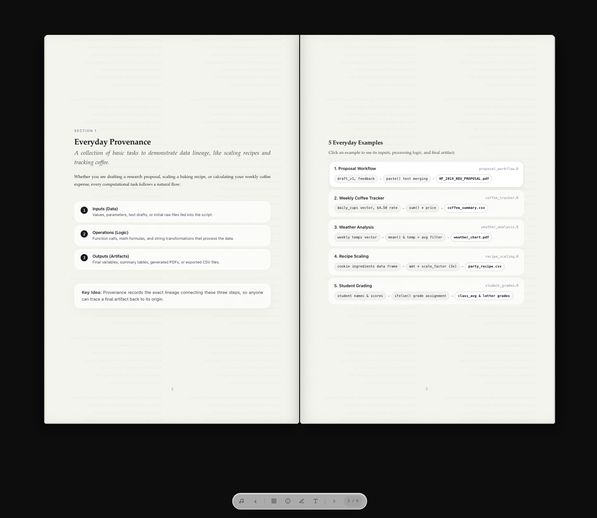
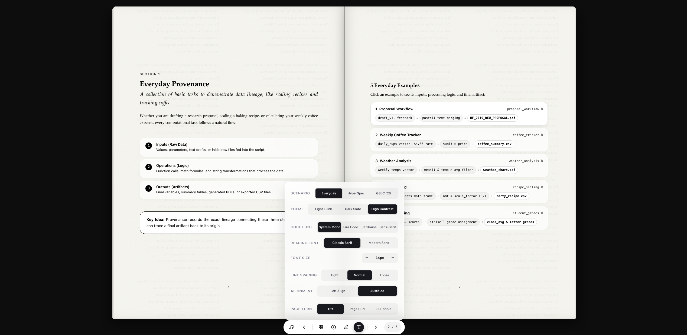

# [provBookR](provBookR.architecture.md)
> Creates an HTML-based visualization of provenance

## Nature of Provenance
How scientific results come to be is the product of various domain-specific, economic, historical, social, and technical factors. Information about how these factors shaped and produced these results is essential to both artistic trade and scientific reproducibility. Whether these results are material or digital, **provenance** provides the historical accounts of objects: paintings, bones, essays, scientific tables, and plots.

## Advancing Scientific Reproducibility
For ecologists and the wider scientific community, the reproducibility of computational experiments is a critical challenge. Modern research relies heavily on complex data pipelines, and understanding exactly how a result was derived is essential for verifying, replicating, and building upon scientific claims. 

**provBookR** addresses this by bridging formal provenance research with practical software engineering workflows. It utilizes End-to-end-provenance tools (such as `rdtLite`) to automatically collect the execution history of R scripts and packages that provenance into an interactive, static web booklet built with **SvelteKit**.



This allows researchers to visually explore the lineage of their data pipelines and specific R objects (e.g., plots, models, variables) through a browser-based reading experience. By making provenance transparent and easily shareable without requiring specialized backend infrastructure, `provBookR` empowers the scientific community to elevate the standard of computational reproducibility.



---

# Installation
Install from GitHub:
```R
# install.packages("devtools")
devtools::install_github("End-to-end-provenance/provBookR")
```

Once installed, load the package:
```R
library(provBookR)
```

# Usage

## 1. Publishing an Interactive Web Codex
The primary method for generating a provenance booklet is through the `publish_codex` function. This automates the process of tracing the script, compiling the frontend interface, and exporting a static HTML directory.

```R
# Automatically trace myscript.R and build a static web booklet
provBookR::publish_codex("myscript.R", output_dir = "my_provbook")
```
This generates a `my_provbook/` folder containing the static HTML, CSS, and JS files. The `index.html` file can be opened directly in a browser or hosted via standard static site hosting services (e.g., GitHub Pages).

## 2. CLI Explorer (Advanced Usage)
> The `provBookR` package also includes a **terminal browser interface** for quickly querying the collected provenance.

To record the provenance from an R script in the terminal:
```R
> provBookR("myscript.R", mode="full")
```

To explore different object lineages using the E2E terminal tools:
```R
> provBookR("prov.json", mode="full")
```
```
provBookR browser running, type "help" for more information or Q to quit
provBookR> help
provBookR(operations)> [command][space][variable.name]:
Quit provBookR                                : "q"   
List R objects                                : "ls"  
Show me how R object was created              : "BO"  
Show me what this R object was used to create : "AO"  
Summarize provenance                          : "S"   
```
