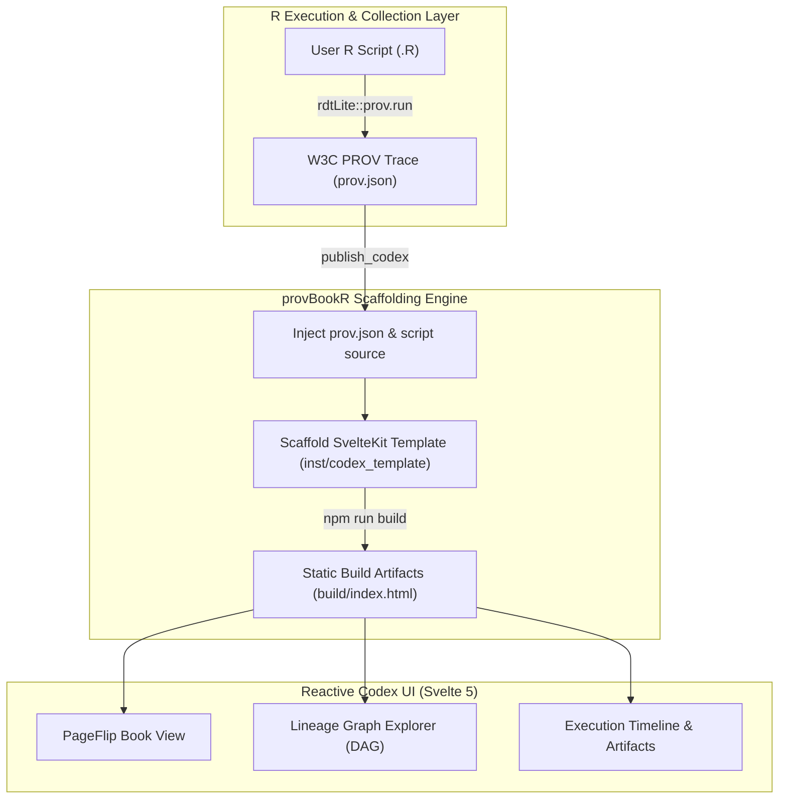

# provBookR Architecture

`provBookR` bridges computational provenance collection in R with modern, web-native digital booklet visualization. The system transforms raw R execution traces into a zero-backend, interactive SvelteKit Single Page Application (SPA) called a **provbook** (or **codex**).

---

## 1. System Data Flow

---

## 2. Architectural Layers

### 2.1 Provenance Collection Layer
* **Collector**: Utilizes `rdtLite` to intercept R script execution, tracking data entities (variables, dataframes, output files) and operations (functions, system calls).
* **Standardization**: Exports provenance graphs complying with the **W3C PROV-JSON** specification and End-to-End Extended Provenance standards.

### 2.2 R Scaffolding & Publishing Engine (`publish_codex`)
* **Payload Assembly**: Reads `prov.json` and the source R script, serializing them into structured JSON payloads inside `inst/codex_template/src/lib/data/`.
* **Static Site Compilation**: Triggers Node.js Vite compilation (`npm run build`) via `@sveltejs/adapter-static` to generate a bundle.
* **Output Delivery**: Copies the resulting HTML/JS/CSS assets into a user-specified output directory (e.g. `codex_build/`).

### 2.3 SvelteKit Codex Engine (`inst/codex_template`)
* **State Management**: Reactive state handled using **Svelte 5 runes** (`$state`, `$derived`) for book navigation, theme options, and annotation panels.
* **Dual View Modes**:
  * **Book Mode**: Interactive two-page flipbook layout for structured reading.
  * **Overview Mode (Slide Sorter)**: Macroscopic spread overview allowing rapid chapter jumping.
* **Visual Lineage Graph**: Directed Acyclic Graph (DAG) rendering node connections, operation dependencies, and cryptographic MD5 file verification hashes.

---

## 3. Deployment & Hosting
* **Zero Backend Requirement**: Compiled codices rely entirely on static client-side web technologies (HTML, SVG, JS, CSS).
* **Cross-Platform Compatibility**: Can be opened locally via `preview_codex()` or deployed directly to GitHub Pages, Netlify, or academic archives.
