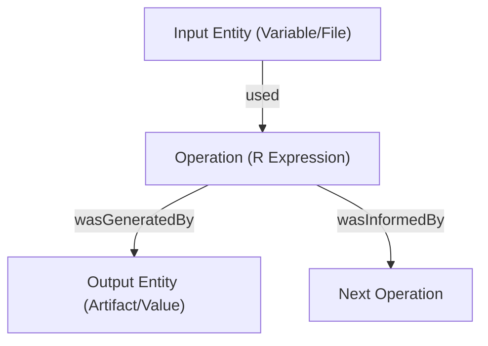

# Provenance Schema & Data Model

`provBookR` translates raw execution trace graphs into structured, interactive digital booklets. This document specifies the mapping between **W3C PROV-JSON** standards captured by `rdtLite` and the reactive TypeScript data model (`ProvSummary`) used in the SvelteKit frontend.

---

## 1. W3C PROV Mapping Overview

Computational execution traces in `provBookR` follow the standard W3C PROV specifications:

| W3C PROV Concept | R Pipeline Element | `provBookR` Node Type | Visual Shape |
| :--- | :--- | :--- | :--- |
| **Activity** | R Function / Expression | **Operation** (`op`) | Blue Diamond / Rect |
| **Entity** | Variable / Data Frame / File | **Data Entity** (`entity`) | Green Circle |
| **Agent** | Operating System / User / R Environment | **Environment** (`env`) | Header Metadata |

---

## 2. Derivation Edge Semantics

Graph topology is defined by directed derivation edges connecting nodes:



* **`used`**: Connects an input data entity to the operation that consumed it.
* **`wasGeneratedBy`**: Connects an operation to the output data entity or artifact it produced.
* **`wasInformedBy`**: Represents direct operational dependency between sequential execution steps.

---

## 3. TypeScript Interface Specification (`ProvSummary`)

Inside `inst/codex_template/src/lib/types/prov.ts`, provenance data is typed as follows:

```typescript
export interface ProvEntity {
  id: string;
  name: string;
  type: string;        // e.g. "data.frame", "numeric", "file"
  value?: string;      // Truncated value preview
  hash?: string;       // Cryptographic MD5 checksum (for file artifacts)
  scope?: string;      // e.g. "global", "local"
}

export interface ProvOperation {
  id: string;
  name: string;        // R code expression
  line?: number;       // Line number in script
  elapsedTime?: number;// Duration in seconds
}

export interface ProvEdge {
  source: string;
  target: string;
  relation: 'used' | 'wasGeneratedBy' | 'wasInformedBy';
}

export interface ProvSummary {
  environment: Record<string, string>;
  operations: ProvOperation[];
  entities: ProvEntity[];
  edges: ProvEdge[];
}
```

---

## 4. Artifact Hash Integrity

File artifacts produced by script execution include cryptographic **MD5 checksum hashes**. The `provBookR` lineage reader displays these hashes in Chapter 5 (Data Lineage) to guarantee data origin authenticity across research teams.
