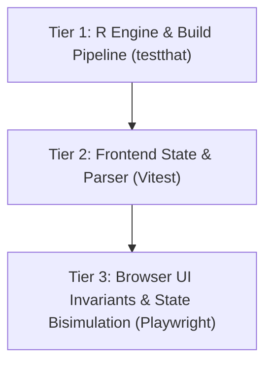

# Testing & Verification Foundations

`provBookR` uses a **stratified verification model** to guarantee correctness across R script execution, JSON schema parsing, reactive state transitions, and browser rendering.

---

## 1. Stratified Verification Tiers



### Tier 1: R Package & Build Pipeline
* **Framework**: `testthat` (`tests/testthat/`).
* **Scope**: Verifies `publish_codex()` executes script tracing, scaffolds template files, invokes Vite bundling, and outputs valid non-empty HTML bundles.

### Tier 2: Frontend Unit & Parser Tests
* **Framework**: `vitest` (`inst/codex_template/src/lib/`).
* **Scope**: Validates W3C PROV-JSON parsing logic (`provParser.test.ts`) and Svelte 5 `$state` runes (`state.test.ts`).

### Tier 3: E2E Browser UI State Bisimulation
* **Framework**: `@playwright/test` (`inst/codex_template/e2e/codex.spec.ts`).
* **Scope**: Performs real browser automated interaction testing:
  * Navigation bounds (Cover $\to$ Spreads $\to$ End bounds).
  * Layout mode toggling (Flipbook vs. Overview Slide Sorter).
  * Guide overlay, annotations panel, and typography controls.

---

## 2. Test Integrity Philosophy (The Red-Blue Rule)

To prevent AI reward hacking or accidental test degradation:
1. **Tests Are Immutable Contracts**: Test suites represent ground-truth behavioral specifications.
2. **Code Corrects to Tests**: When an assertion fails during development, the application implementation MUST be modified to satisfy the test contract, rather than relaxing or deleting the test.

---

## 3. Running Verification Commands

```bash
# 1. Run R package check
Rscript -e 'devtools::check()'

# 2. Run Frontend Unit Tests
cd inst/codex_template
npm run test

# 3. Run Playwright E2E Tests
npm run test:e2e
```
